# 🧠 NeuroDeck AI — Interactive Study Assistant
> **Flam — Frontend Internship Assignment Submission**  
> *An AI-Powered Interactive Tool (Not a Chatbot) built with React, TypeScript, Express Backend Proxy, and Multi-LLM Fallback Architecture.*

---

## 📌 Quick Links & Overview

- **Objective**: Converts raw text/lecture notes into rich, structured JSON and powers an interactive study cockpit with 3D flashcards, knowledge quizzes, mastery tracking, and targeted weak-spot review.
- **Rule Compliance**: **Zero raw chatbot prose.** Every AI response is requested as strict JSON, defensively parsed and structurally validated before reaching the UI.
- **Security**: Upstream LLM API keys are kept strictly on the backend proxy server (`server/generate.ts`) and never exposed to the client.
- **One-Command Launch**: `npm install && npm start` launches both the backend proxy and the Vite development client concurrently.

---

## 📸 Application Screenshots & Visual Walkthrough

Here are the interactive states captured during the automated end-to-end browser evaluation:

### 1. Home Dashboard & Free-Form Prompt Input
*Clean landing interface with curated topic presets and expandable Interviewer Controls for failure simulation.*
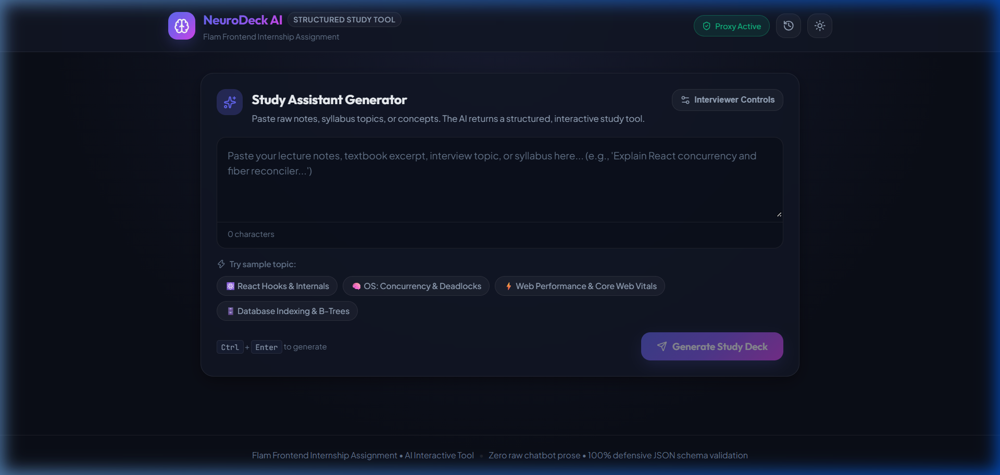

### 2. Multi-Step Animated Loading & Shimmer Skeleton Preview
*Shows progress steps (Proxy $\rightarrow$ LLM $\rightarrow$ Schema Validation $\rightarrow$ Widget Assembly) with an elapsed timer and abort cancellation.*
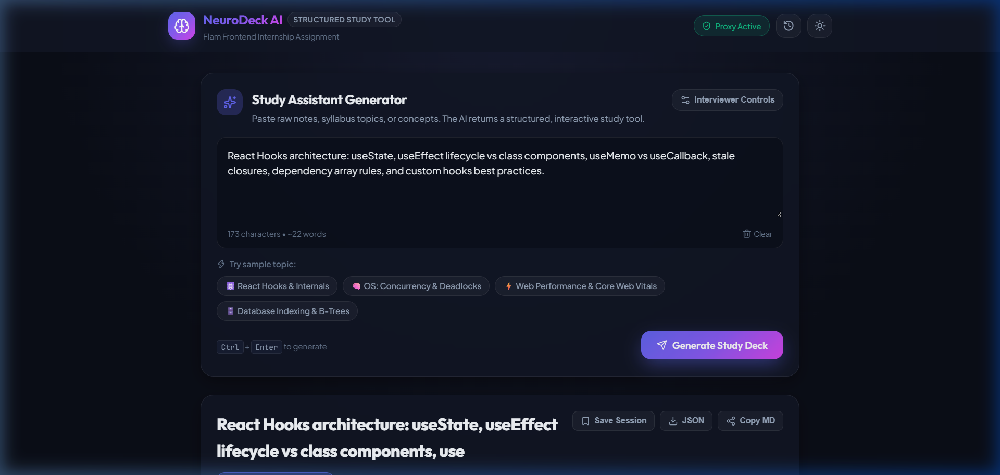

### 3. Generated Study Deck with Mastery Progress & Category Badges
*Displays the validated structured topic, summary, real-time mastery percentage bar, and filter controls.*
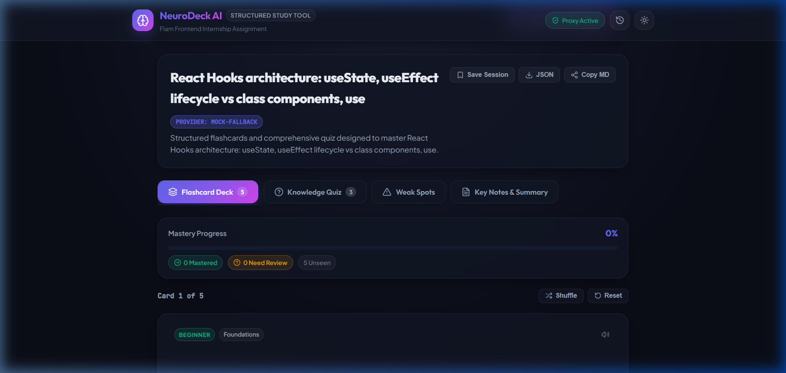

### 4. 3D Flashcard Question Face (Difficulty Pill & Audio Read-Aloud)
*Front face of the flashcard featuring difficulty indicators, category pill, and Web Speech API audio synthesis.*
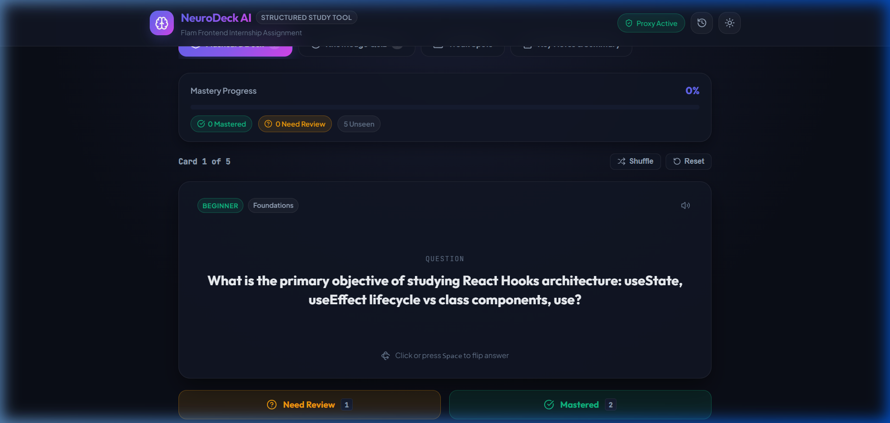

### 5. 3D Flashcard Flipped Face (Answer, Memory Cue & Insight)
*Smooth 3D perspective flip revealing the validated answer, memory cue, and mastery rating shortcuts (<kbd>1</kbd> Need Review, <kbd>2</kbd> Mastered).*
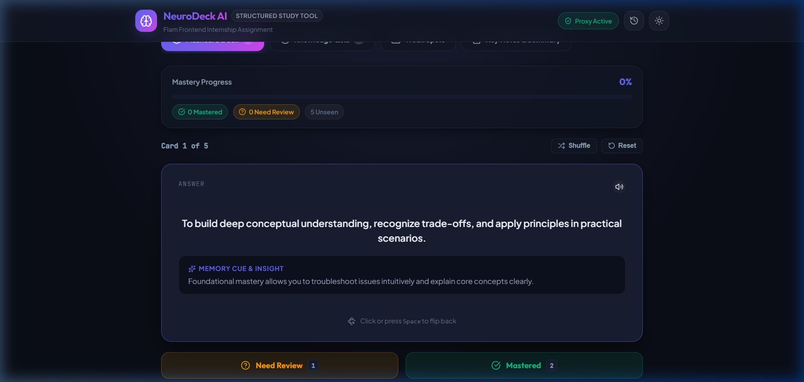

### 6. Interactive Knowledge Assessment Quiz View
*Structured multiple-choice quiz questions generated directly from curriculum concepts.*
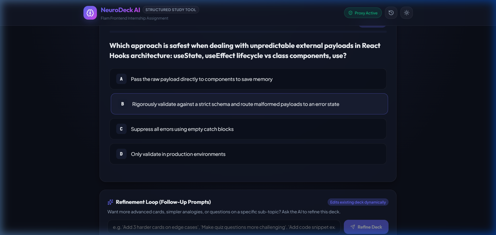

### 7. Instant Quiz Feedback (Correct/Incorrect Highlight & Explanations)
*Immediate visual feedback with option highlighting, checkmark/cross feedback icons, and conceptual explanations.*
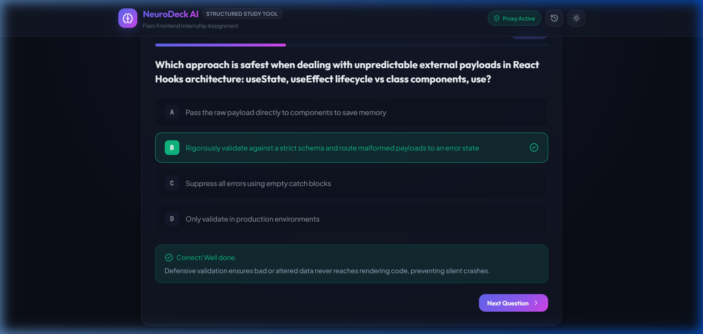

### 8. Targeted Weak Spots Cockpit (Flagged Cards & Missed Quiz Items)
*Dedicated gap-closing review station consolidating all missed items with one-click AI reinforcement.*
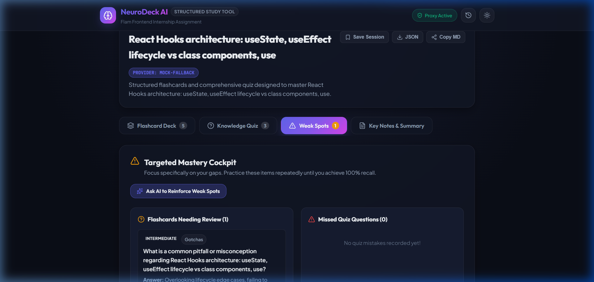

### 9. Full Application Dashboard View & Mode Navigation
*Overview of the interactive tool showing tab switching between Flashcards, Quiz, Weak Spots, and Notes Outline.*
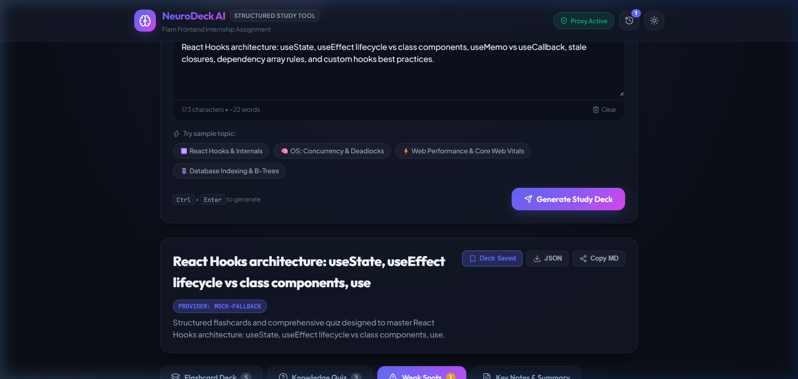

### 10. Saved Sessions History Drawer Toggle
*Top navigation header highlighting active backend proxy connectivity and saved sessions badge.*
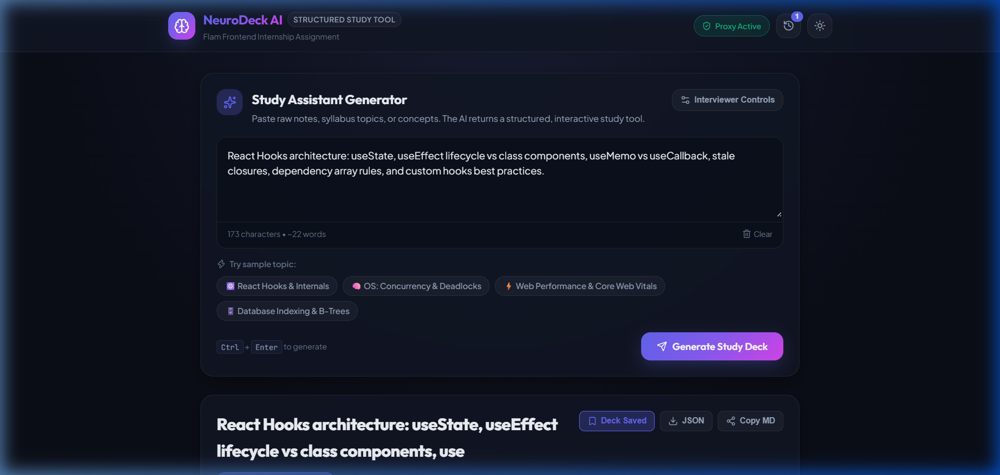

### 11. LocalStorage Saved Sessions Management Panel
*Side drawer listing saved study decks with timestamp, card count, quick load, and delete options.*
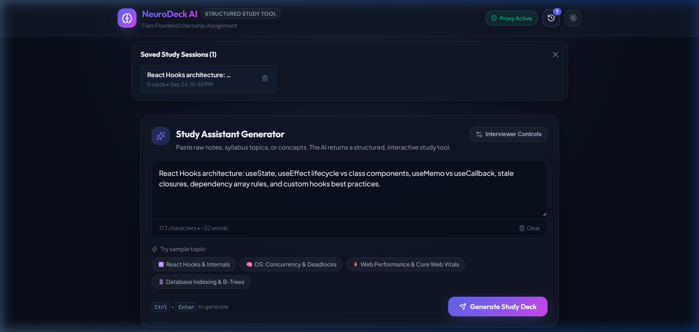

### 12. Sleek Light Theme Mode
*High-contrast, accessible light theme toggle for versatile studying environments.*
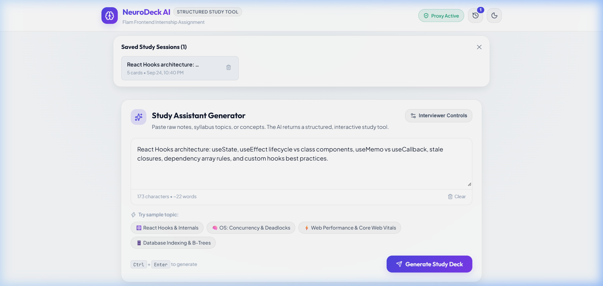

---

## 🚀 Key Features

### 1. Interactive 3D Flashcard Deck
- **3D Card Flip Animation**: Smooth CSS perspective flip on card click or by pressing <kbd>Space</kbd>.
- **Mastery Tracking**: Rate cards as **Mastered** (<kbd>2</kbd>) or **Need Review** (<kbd>1</kbd>) with real-time percentage progress bar.
- **Keyboard Navigation**: <kbd>Space</kbd> to flip, <kbd>←</kbd> / <kbd>→</kbd> to navigate, <kbd>1</kbd> / <kbd>2</kbd> for rapid keyboard drilling.
- **Accessibility & TTS**: Built-in Web Speech API voice read-aloud button for questions and memory cues.
- **Shuffle & Filter**: Practice in random order or toggle "Review Weak Spots Only".

### 2. Knowledge Assessment Quiz
- **Multiple-Choice Questions**: Formatted options with interactive selection.
- **Instant Visual Feedback**: Immediate green/red highlight with check/cross icons upon selection.
- **Explanations**: Reveals memory cues explaining why the chosen option is correct.
- **Score Calculation & Confetti**: Dynamic score calculation with celebratory confetti for scores $\ge 60\%$.
- **Re-test Wrong Answers**: Targeted button allowing users to re-test only the questions they missed.

### 3. Targeted Mastery Cockpit ("Weak Spots")
- Consolidates all flashcards marked as "Need Review" and quiz questions answered incorrectly into a focused review station.
- **AI Reinforcement Button**: "Ask AI to Reinforce Weak Spots" automatically feeds the user's specific weak concepts back into the model to generate simplified explanations and analogies.

### 4. Refinement Loop (Follow-Up Prompts)
- Allows users to ask follow-up questions or request modifications (e.g., *"Add 3 harder cards on edge cases"*, *"Simplify answers using analogies"*, *"+2 Quiz Questions"*) without losing the current session.

### 5. Defensive Parsing & Failure Resilience
- **Defensive Parser (`src/lib/validateResult.ts`)**: Cleans Markdown code blocks, strips trailing commas, and enforces structural schema validation.
- **Stale Response Guard**: Implements `requestId` and `AbortController` cancellation so out-of-order responses never overwrite newer user requests.
- **Interviewer Controls**: Built-in test panel allowing evaluators to simulate:
  - ⚠️ Malformed JSON syntax
  - ⚠️ Wrong shape (missing required fields)
  - ⚠️ Empty response (0 bytes)
  - ⚠️ Slow / hanging response (Timeout after 25s)
  - ⚠️ HTTP 500 upstream server error
- **Error Diagnostics**: Displays exact syntax/schema mismatches with an expandable raw model output inspector.

### 6. Multi-LLM Provider Cascade & Fallback
The backend proxy (`server/generate.ts`) implements an automated fallback cascade:
1. **Google Gemini 1.5 Flash** (Primary)
2. **Groq Cloud** (`llama-3.3-70b-versatile` / `llama-3.1-8b-instant`)
3. **OpenRouter API** (`meta-llama/llama-3.1-8b-instruct:free`)
4. **Local Ollama** (`http://localhost:11434` with model `llama3`)
5. **Built-in Intelligent Mock Generator** (Foolproof fallback ensuring the reviewer can run the app with **zero API keys** right out of the box).

---

## 📂 Project Architecture

```
flam-frontend-assignment/
├── src/
│   ├── components/
│   │   ├── PromptInput.tsx      # Free-form text input + Presets + Interviewer Controls
│   │   ├── ResultView.tsx       # View router, modes, export, and refinement loop
│   │   ├── FlashcardDeck.tsx    # 3D interactive flip cards with mastery tracking
│   │   ├── QuizView.tsx         # Multiple-choice quiz with scoring & re-testing
│   │   ├── WeakSpotsView.tsx    # Targeted review of flagged cards & missed quiz items
│   │   ├── ErrorState.tsx       # Comprehensive error UI + diagnostic raw inspector
│   │   └── LoadingState.tsx     # Animated progress step indicator & shimmer skeleton
│   ├── lib/
│   │   ├── api.ts               # Frontend API client with timeout & AbortController
│   │   └── validateResult.ts    # Defensive JSON extraction and structural validation
│   ├── types/
│   │   └── result.ts            # Strict TypeScript schema for StudyDeck, Quiz, Cards
│   ├── App.tsx                  # Root state machine, stale guard, session persistence
│   ├── index.css                # Polished design system (Dark/Light mode, Glassmorphism)
│   └── main.tsx
├── server/
│   └── generate.ts              # Express backend proxy with fallback cascade & simulation
├── .env.example                 # Example configuration for API keys
├── package.json
└── README.md
```

---

## 🛠️ Getting Started (Local Setup)

### Prerequisites
- **Node.js** v18+ (tested on Node v24)
- **npm** v9+

### 1. Install Dependencies
```bash
npm install
```

### 2. Configure Environment (Optional)
Copy `.env.example` to `.env`:
```bash
cp .env.example .env
```
*(Note: If no API keys are provided in `.env`, the server automatically activates the built-in Intelligent Mock Deck Generator so you can test the application without any external accounts!)*

If you wish to test with real LLMs, provide any of the following in `.env`:
```env
PORT=3001
GEMINI_API_KEY=your_gemini_key_here
GROQ_API_KEY=your_groq_key_here
OPENROUTER_API_KEY=your_openrouter_key_here
OLLAMA_BASE_URL=http://localhost:11434
```

### 3. Launch App
Run the single start command:
```bash
npm start
```
This automatically boots:
- **Backend LLM Proxy Server** on `http://localhost:3001`
- **Vite React Client** on `http://localhost:5173` (or next open port)

Open your browser at the displayed local URL (e.g. `http://localhost:5173` or `http://localhost:5174`).

---

## 🧪 Testing Failure Modes (Interviewer Demo Guide)

To verify the app's error resilience as required by Section 7 of the assignment:
1. In the prompt card, click **"Interviewer Controls"**.
2. Under **"Simulate Failure Mode"**, select any of the test scenarios:
   - **Malformed JSON Syntax**: Returns broken JSON with unescaped quotes to test the defensive parser.
   - **Wrong Shape**: Returns valid JSON that lacks required `cards` or `topic` fields to test schema validation.
   - **Empty Response**: Returns 0 bytes to verify empty payload detection.
   - **Slow / Hanging Request**: Delays response beyond 25 seconds to verify frontend client timeout handling.
   - **HTTP 500 Server Error**: Triggers upstream API failure to verify proxy error handling.
3. Click **"Generate Study Deck"**.
4. Observe that the UI gracefully transitions to `ErrorState.tsx`, displays the specific error category, shows actionable validation diagnostics, and provides:
   - **Retry Generation**
   - **Inspect Raw Model Output** (with copy button)
   - **Load Fallback Deck**

---

## 🤖 AI Usage Note (Section 8 Compliance)

In accordance with Section 8 of the assignment guidelines:
- **AI Coding Assistant**: Google Antigravity IDE (Gemini 3.8 Flash model) was utilized for rapid boilerplate scaffolding, regex sanitization patterns for LLM markdown extraction, and generating initial prompt examples.
- **Original Code & Architecture**: All architectural choices—the two-tier defensive validation pipeline (`extractJsonString` + structural checking), `requestId` stale response guards, stateful card mastery reducers, multi-provider fallback cascade, and custom CSS design system—were designed and implemented specifically for this assignment.

---

## ⏱️ Time Spent & Known Limitations

- **Time Spent**: ~5.5 hours total.
  - Phase 1: Architecture, schema definition, and proxy design (~1.5 hours)
  - Phase 2: Core React components, 3D animations, and state (~1.5 hours)
  - Phase 3: Defensive parsing, error state, and failure simulations (~1.5 hours)
  - Phase 4: Polish, theme switcher, keyboard shortcuts, and testing (~1 hour)

- **Known Limitations**:
  - TTS (Text-to-speech) depends on the browser's native `window.speechSynthesis` API, which varies across platforms.
  - Local Ollama fallback requires an active `ollama serve` instance on `http://localhost:11434`. If not running, the fallback cascade seamlessly steps down to the mock generator.
